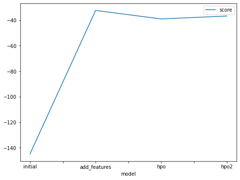
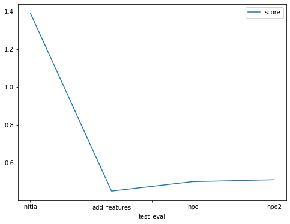

# Report: Predict Bike Sharing Demand with AutoGluon Solution
#### Devdatta Jadhav

## Initial Training
### What did you realize when you tried to submit your predictions? What changes were needed to the output of the predictor to submit your results?
Kaggle doesn't accept the values which are less than 0. So, I converted the negative values to 0 and submitted the results. 

### What was the top ranked model that performed?
Weighted Ensemble L3 is the model that performed well. Upon adding additional features of date, month and year, the performance improved drastically.

## Exploratory data analysis and feature creation
### What did the exploratory analysis find and how did you add additional features?
Upon Exploratory Data Analysis, I inferred the following:
1. The features - Season and Weather are categorical.
2. The features - holiday and working day are binary values. 
3. Datetime is a datetime object, and it is transformed to 3 different features - day, month, year, hour, weekday.

### How much better did your model preform after adding additional features and why do you think that is?
After adding additional features, the accuracy of the model is increased significantly. This is because the new features are strongly correlated to the target. 

## Hyper parameter tuning
### How much better did your model preform after trying different hyper parameters?
After, trying out different parameters, I did notice that the performance of the model is changed. The model with the hyperperameters and new features performs more or less same as the one without hyperperameter configurations.   

### If you were given more time with this dataset, where do you think you would spend more time?
1. I could spend some time more on EDA and see if I could derive new features to improve the model's prediction.
2. I could also send time on tuning the hyper parameters. 

### Create a table with the models you ran, the hyper parameters modified, and the kaggle score.

| Model             | initial     | new_features| hpo         | hpo2        | 
| -----------       | ----------- | ----------- | -----       | ----------- |  
| num_epochs        | default     | default     | 10          | 20          |  
| num_boost_round   | default     | default     | 100         | 200         |  
| time              | 600         | 600         | 600         | 600         | 
| score             | -114.853277 | -32.339708  | -39.010497  | -36.742658  |

### Create a line plot showing the top model score for the three (or more) training runs during the project.

### Create a line plot showing the top kaggle score for the three (or more) prediction submissions during the project.

## Summary
With this assignment I aimed solving a regression problem to predict the bike sharing demand, given the historical data.
Framework used - AutoGluon 
The initial model was built with the default predictor and the model doesn't perform great. 
With Exploratory Data Analysis, assigned right data types for the features and with feature engineering, created new features based on the date time.
With the new features, the performance of the model is drastically increased.
Hyper parameter tuning is also done to improve the performance but that did not yield better results as of now.
The final Submission is made to Kaggle and obtained a score of 0.453  [RMSE]
The model with new features is found to be performing better. 
